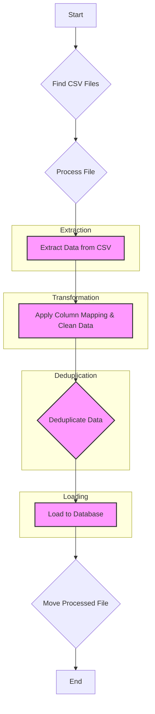

# ETL Pipeline Architecture Overview

This document provides a comprehensive overview of the ETL (Extract, Transform, Load) pipeline. The system is designed to process contact information from CSV files, clean and transform the data, perform deduplication, and load the results into a PostgreSQL database.

## 1. Core Objective

The primary goal of this pipeline is to automate the ingestion of new contact data from various CSV sources. It ensures data quality through cleaning, standardization, and a robust deduplication process, preventing redundant entries in the central `contacts` database.

## 2. Pipeline Workflow

The ETL process is orchestrated by `etl/main.py` and follows a sequential, multi-stage workflow for each source file found.

### Stages:

1.  **Initialization**:
    *   Loads the database connection URL from `.env`.
    *   Reads configuration from `config.yaml`.
    *   Sets up logging to both console and a rotating file (`etl/logs/pipeline.log`).

2.  **Pre-fetch for Deduplication**:
    *   Before processing files, it connects to the database and fetches all existing `company_name` and `phone_number` values from the `contacts` table to be used in the deduplication step.

3.  **Extraction (`etl/extract.py`)**:
    *   Scans the `source_directory` (defined in `config.yaml`) for new `.csv` files.
    *   Reads each CSV file into a pandas DataFrame.

4.  **Transformation (`etl/transform.py`)**:
    *   **Column Mapping**: Renames columns from the source CSV to the target database schema based on the flexible `column_mapping` rules in `config.yaml`.
    *   **JSON Aggregation**: Columns specified under `additional_info` in the config are consolidated into a single JSONB column.
    *   **Data Cleaning**:
        *   Removes special characters from phone numbers.
        *   Trims whitespace from all string-based columns.

5.  **Deduplication (`etl/main.py`)**:
    *   **Phone Number Check**: An exact match is performed to discard any records where the `phone_number` already exists in the database.
    *   **Fuzzy Company Name Matching**: Uses the `rapidfuzz` library to compare the `company_name` against existing names. If the similarity score exceeds the `company_name_threshold` from `config.yaml`, the record is flagged as a potential duplicate.
    *   **Review Process**: Potential duplicates are not loaded. They are saved to a separate CSV in the `review_directory` for manual inspection.

6.  **Load (`etl/load.py`)**:
    *   The final, cleaned, and unique data is loaded into the `contacts` table in the PostgreSQL database.
    *   The operation uses an `append` method, as duplicates have already been filtered out.

7.  **File Management**:
    *   After a file is successfully processed, it is moved from the source directory to the `processed_directory`.

## 3. Key Components

*   **`etl/main.py`**: The main orchestrator that runs the entire pipeline.
*   **`etl/extract.py`**: Handles finding and reading source CSV files.
*   **`etl/transform.py`**: Contains logic for data cleaning and restructuring.
*   **`etl/load.py`**: Manages database connections and data loading.
*   **`etl/setup_database.py`**: Defines the `contacts` table schema and ensures it exists in the database.
*   **`config.yaml`**: A critical configuration file that makes the pipeline adaptable. It controls file paths, column mappings, and the deduplication threshold.
*   **`etl/requirements.txt`**: Lists all Python dependencies for the project.

## 4. Database Schema

The target `contacts` table is defined in `etl/setup_database.py`.

**Table: `contacts`**
| Column | Type | Constraints | Description |
| :--- | :--- | :--- | :--- |
| `id` | `SERIAL` | `PRIMARY KEY` | Unique identifier for each record. |
| `company_name` | `TEXT` | `NOT NULL` | Name of the company. |
| `url` | `TEXT` | | Company website. |
| `phone_number` | `TEXT` | `UNIQUE` | Contact phone number (enforces no duplicates). |
| `is_b2b` | `BOOLEAN` | | Flag for B2B status. |
| `industry` | `TEXT` | | Company's industry. |
| `customer_target_segments` | `TEXT` | | Target customer segments. |
| `additional_info` | `JSONB` | | Catch-all for extra data from source files. |
| `tags` | `TEXT[]` | | Array of tags for categorization. |
| `status` | `TEXT` | `DEFAULT 'active'` | Current status of the contact. |
| `last_used` | `TIMESTAMP` | | Timestamp of the last interaction. |
| `created_at` | `TIMESTAMP` | `DEFAULT NOW()` | Timestamp of record creation. |
| `updated_at` | `TIMESTAMP` | `DEFAULT NOW()` | Timestamp of the last update. |

This schema is robust, with a unique constraint on `phone_number` providing a hard stop for duplicates at the database level and a `JSONB` column for flexible data storage.